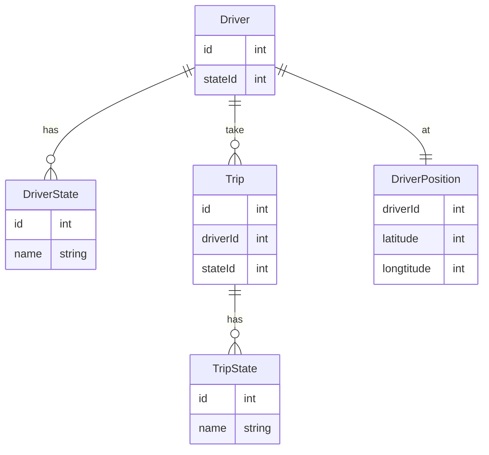

```mermaid
erDiagram
    Driver {
        id int
        stateId int
    }

    DriverState {
        id int
        name string
    }

    Trip {
        id int
        driverId int
        stateId int
    }

    TripState {
        id int
        name string
    }

    DriverPosition {
        driverId int
        latitude int
        longtitude int
    }

    Driver ||--o{ DriverState : has
    Trip ||--o{ TripState: has
    Driver ||--o{ Trip: take
    Driver ||--|| DriverPosition: at
```