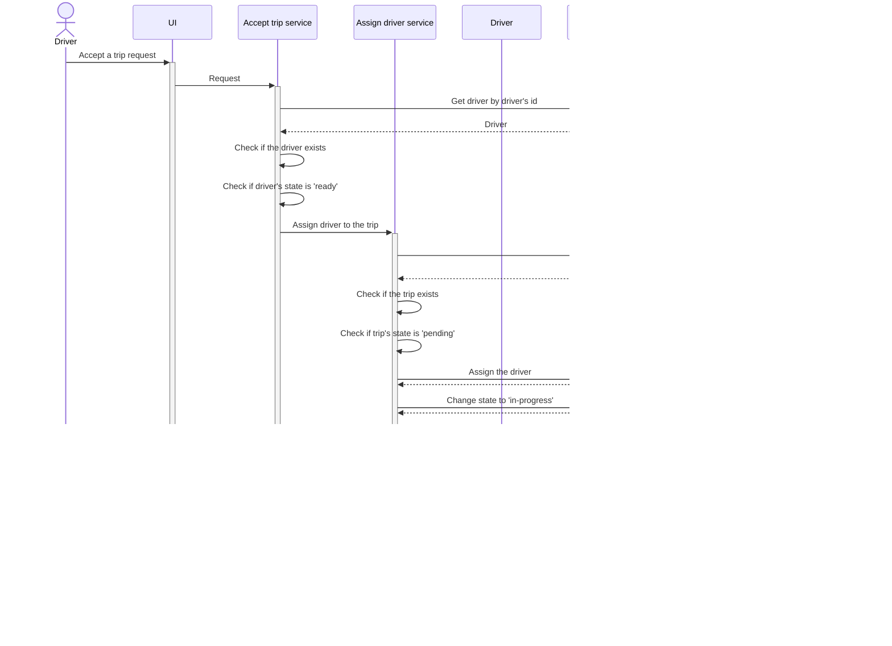

```mermaid
sequenceDiagram
    actor DA as Driver
    participant UI
    participant AcS as Accept trip service
    participant AsS as Assign driver service
    participant DE as Driver
    participant TE as Trip
    participant DR as Driver repository
    participant TR as Trip repository

    DA->>+UI: Accept a trip request
    UI->>+AcS: Request
    AcS->>+DR: Get driver by driver's id
    DR-->>-AcS: Driver
    AcS->>AcS: Check if the driver exists
    AcS->>AcS: Check if driver's state is 'ready'
    AcS->>+AsS: Assign driver to the trip
    AsS->>+TR: Get trip by trip's id
    TR-->>-AsS: Trip
    AsS->>AsS: Check if the trip exists
    AsS->>AsS: Check if trip's state is 'pending'
    AsS->>+TE: Assign the driver
    TE-->>AsS: 
    AsS->>TE: Change state to 'in-progress'
    TE-->>-AsS: 
    AsS->>+TR: Save trip
    TR->>-AsS: 
    AsS-->>-AcS: Success status
    AcS->>+DE: Change state to 'transporting'
    DE-->>-AcS: 
    AcS->>+DR: Save driver
    DR-->>-AcS:
    AcS-->>-UI: Success status
    UI->>UI: Display customer's position
    UI-->>-DA:
```