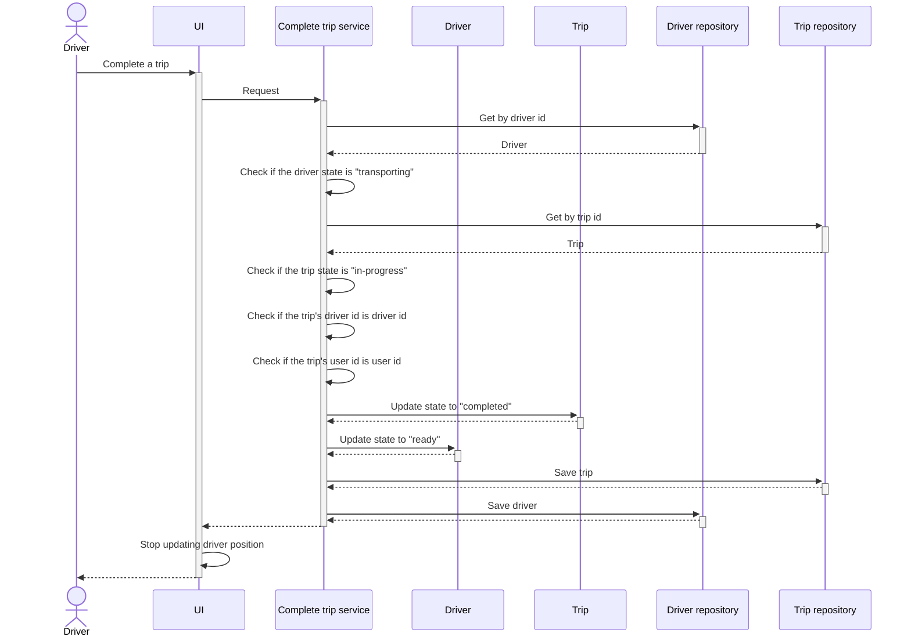

```mermaid
sequenceDiagram
    actor DA as Driver
    participant UI
    participant CS as Complete trip service
    participant DE as Driver
    participant TE as Trip
    participant DR as Driver repository
    participant TR as Trip repository

    DA->>+UI: Complete a trip
    UI->>+CS: Request
    CS->>+DR: Get by driver id
    DR-->>-CS: Driver
    CS->>CS: Check if the driver state is "transporting"
    CS->>+TR: Get by trip id
    TR-->>-CS: Trip
    CS->>CS: Check if the trip state is "in-progress"
    CS->>CS: Check if the trip's driver id is driver id
    CS->>CS: Check if the trip's user id is user id
    CS->>+TE: Update state to "completed"
    TE-->>-CS:
    CS->>+DE: Update state to "ready"
    DE-->>-CS:
    CS->>+TR: Save trip
    TR-->>-CS:
    CS->>+DR: Save driver
    DR-->>-CS: 
    CS-->>-UI:
    UI->>UI: Stop updating driver position
    UI-->>-DA:
```