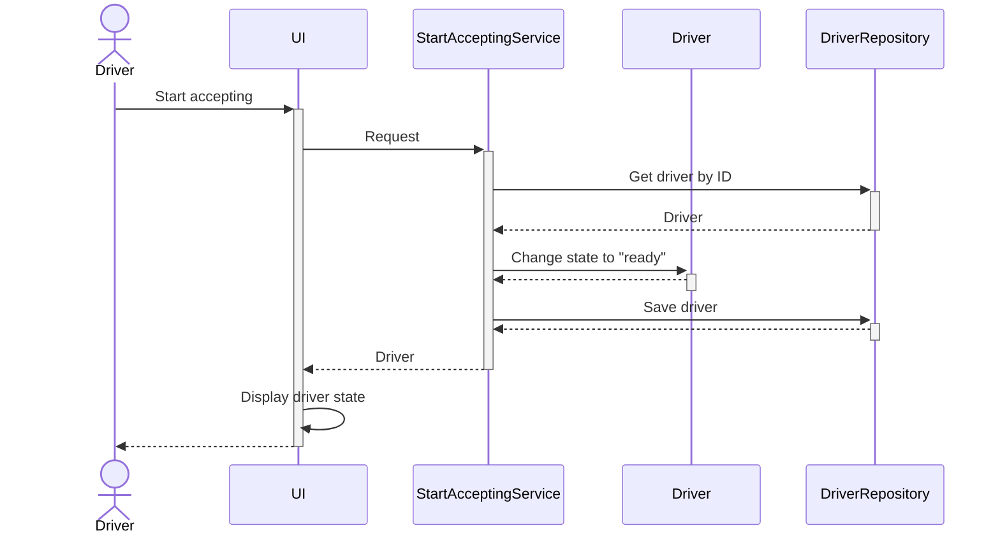

```mermaid
sequenceDiagram
    actor DA as Driver
    participant UI
    participant SS as StartAcceptingService
    participant DE as Driver
    participant DR as DriverRepository    

    DA->>+UI: Start accepting
    UI->>+SS: Request
    SS->>+DR: Get driver by ID
    DR-->>-SS: Driver
    SS->>+DE: Change state to "ready"
    DE-->>-SS: 
    SS->>+DR: Save driver
    DR-->>-SS:
    SS-->>-UI: Driver
    UI->>UI: Display driver state
    UI-->>-DA:
```