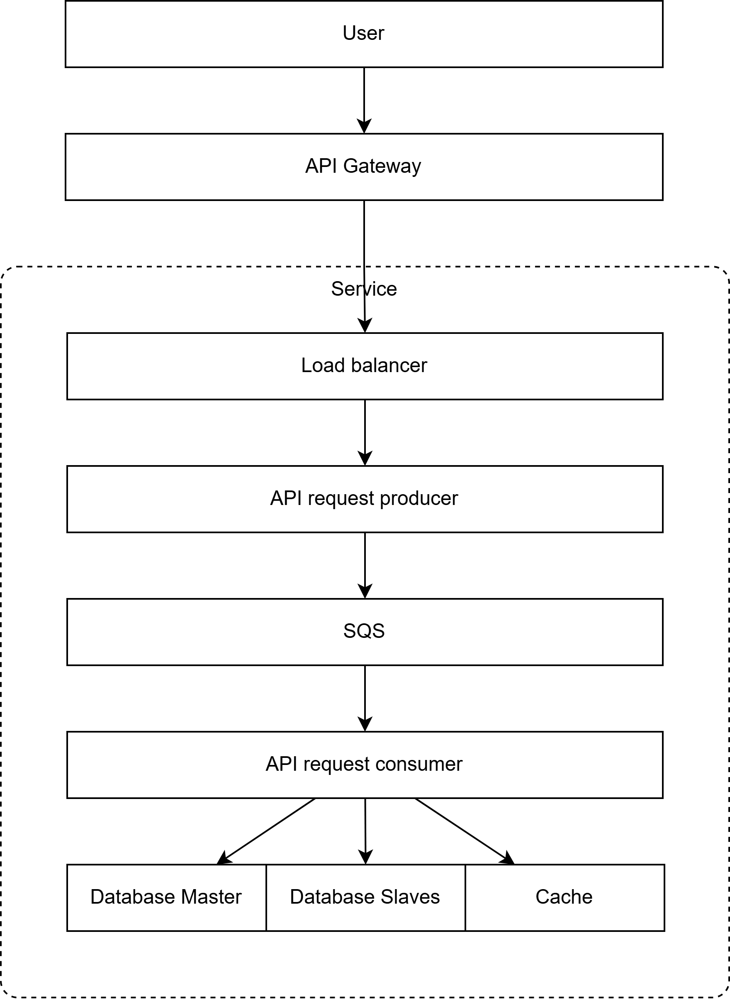

# BÁO CÁO CUỐI KỲ UIT-GO
## Các thành viên
- 23520592 - Cao Thành Huy
- 23520557 - Dương Quốc Hưng
- 23520946 - Nguyễn Xuân Nhật Minh

# Tổng quan kiến trúc hệ thống

## Giải thích sơ đồ

1. **User Service**
    - Giao tiếp với Trip Service khi người dùng đặt, hủy, xem giá cước, đánh giá chuyến đi.
    - Lưu dữ liệu chính trên PostgreSQL, cache trên Redis.

2. **Driver Service**
    - Giao tiếp với Trip Service khi tài xế chấp nhận, từ chối, hoàn thành chuyến đi.
    - Lưu dữ liệu chính trên PostgreSQL, lưu thông tin vị trí và cache trên Redis.
    - Dùng tRPC để cập nhật vị trí liên tục.

3. **Trip Service**
    - Giao tiếp với Driver Service khi tìm tài xế trong phạm vi và xem vị trí tài xế.
    - Lưu dữ liệu chính trên PostgreSQL.

# Phân tích Module Chuyên sâu: Mô tả Cách tiếp cận và Kết quả

Trong quá trình xây dựng hệ thống theo kiến trúc microservices với ba dịch vụ chính (User Service, Driver Service, Trip Service), nhóm đã áp dụng một số quyết định kỹ thuật quan trọng theo chuẩn **Architecture Decision Record (ADR)**. Mỗi quyết định giải quyết một vấn đề cụ thể trong vận hành hệ thống phân tán và hướng đến việc đạt được hiệu năng cao, khả năng mở rộng (scalability) và độ ổn định (reliability).

Dưới đây là phân tích tổng hợp các ADR và lý do thiết kế module, cùng tác động thực tế khi triển khai.

---

## 1. Sử dụng Redis làm hệ thống lưu trữ vị trí tài xế

### Cách tiếp cận
Quản lý vị trí tài xế yêu cầu khả năng:
- cập nhật vị trí liên tục.
- truy vấn theo phạm vi địa lý.
- đáp ứng độ trễ thấp.

Redis được chọn vì:
- hỗ trợ cấu trúc dữ liệu **Redis GEO** phục vụ tìm kiếm theo bán kính.
- tốc độ xử lý rất nhanh do lưu trữ trên RAM.

### Kết quả
- Thời gian truy vấn vị trí tài xế giảm đáng kể so với database truyền thống.
- Việc tìm tài xế gần nhất được xử lý mượt, đáp ứng nhu cầu realtime.

---

## 2. Sử dụng tRPC để truy cập vị trí tài xế

### Cách tiếp cận
Để tối ưu giao tiếp giữa client và service, hệ thống lựa chọn **tRPC** thay vì REST nhờ:
- khả năng truyền dữ liệu typed endpoint.
- overhead thấp hơn.
- mô hình giao tiếp gần với direct function-call.

### Kết quả
- Tốc độ gọi API tăng do payload nhỏ.

---

## 3. Sử dụng Cache cho các server

### Cách tiếp cận
Để giảm tải lên database và tăng tốc độ phản hồi, Redis được sử dụng làm hệ thống cache cho:
- thông tin tài xế,
- thông tin người dùng,

### Kết quả
- Tốc độ truy vấn tăng.
- Database giảm tải đáng kể.
- Yêu cầu xử lý thêm các cơ chế TTL để đảm bảo tính nhất quán.

---

## 4. Sử dụng Request Queue cho server

### Cách tiếp cận
Các tác vụ phức tạp hoặc dễ gây nghẽn được chuyển sang mô hình **asynchronous** bằng **message queue**, áp dụng cho:
- cập nhật trạng thái tài xế,
- xử lý lượng request lớn giữa các service.

Queue giúp điều tiết request và bảo vệ server khỏi quá tải.

### Kết quả
- Server hoạt động ổn định hơn dưới tải cao.
- Request không bị mất khi service downtime nhờ cơ chế retry.
- Tuy nhiên, tăng độ trễ và đòi hỏi thiết kế idempotency.

---
# Tổng hợp Các quyết định thiết kế và Trade-off

Phần này tổng hợp các quyết định thiết kế quan trọng đã được đưa ra trong quá trình xây dựng hệ thống. Mỗi quyết định đều dựa trên các tiêu chí: hiệu năng, độ ổn định, khả năng mở rộng và khả năng bảo trì trong môi trường microservices. Dưới đây là phân tích chi tiết từng lựa chọn, lý do và trade-off đi kèm.

---

## 1. Sử dụng Redis để lưu trữ vị trí tài xế

### Lựa chọn & Lý do
- Redis hoạt động trên RAM, cho phép truy cập dữ liệu cực nhanh.
- Hỗ trợ **Redis GEO** giúp tìm kiếm tài xế theo bán kính hiệu quả.
- Phù hợp với dữ liệu thay đổi liên tục như vị trí theo thời gian thực.

### Trade-off
- Tốn chi phí RAM hơn so với database truyền thống.

---

## 2. Sử dụng tRPC để truyền tải và truy vấn vị trí tài xế

### Lựa chọn & Lý do
- tRPC có độ trễ thấp hơn REST vì không cần serialization phức tạp.
- Tích hợp chặt chẽ với TypeScript, đảm bảo **type-safety** giữa client và server.
- Giảm overhead và chi phí phát triển API.

### Trade-off
- Hạn chế khi cần mở API cho hệ thống bên ngoài (REST phổ biến hơn).
- Coupling cao hơn giữa client/server do shared types.
- Không phù hợp với các service viết bằng ngôn ngữ khác TypeScript.

---

## 3. Sử dụng Cache (Redis) cho các server

### Lựa chọn & Lý do
- Giảm tải lên database, cải thiện thời gian phản hồi.
- Phù hợp cho các dữ liệu thay đổi ít hoặc cần truy vấn nhiều lần (driver info, user info...).

### Trade-off
- Cần thiết kế cơ chế **cache invalidation**, tránh dữ liệu lỗi thời.
- Khi tỷ lệ cache miss cao → server phải xử lý nhiều hơn, tăng thời gian phản hồi.
- Tốn thêm tài nguyên và chi phí để vận hành hệ thống cache riêng.

---

## 4. Sử dụng Request Queue để điều tiết tải của server

### Lựa chọn & Lý do
- Queue giúp buffer request khi lượng truy cập tăng đột biến.
- Các tác vụ phức tạp (tạo chuyến đi, cập nhật trạng thái) có thể xử lý bất đồng bộ.
- Giảm nguy cơ server bị nghẽn hoặc quá tải.

### Trade-off
- Tăng độ trễ xử lý vì request không được thực thi ngay lập tức.
- Yêu cầu thiết kế **idempotent** để tránh xử lý trùng do retry.
- Phức tạp hơn trong vận hành (message broker, monitoring, DLQ...).

---
# Thách thức & Bài học kinh nghiệm

Trong quá trình triển khai hệ thống microservices với nhiều thành phần như Redis, tRPC, Cache và Request Queue, nhóm đã gặp nhiều thách thức kỹ thuật khác nhau. Việc phân tích lại các vấn đề này giúp rút ra những bài học quan trọng cho việc mở rộng và vận hành hệ thống trong tương lai.

---

## 1. Thách thức trong việc sử dụng tRPC thay vì REST

### Thách thức
- tRPC phù hợp cho TypeScript nhưng gây khó khăn khi mở rộng sang service dùng ngôn ngữ khác.
- Quá phụ thuộc vào type-sharing khiến thay đổi nhỏ có thể ảnh hưởng toàn hệ thống.

### Bài học kinh nghiệm
- Tham khảo sử dụng gRPC trong tương lai thay vì tRPC.

---

## 2. Thách thức khi triển khai Cache

### Thách thức
- Khi tỷ lệ cache miss cao, server bị tăng tải bất ngờ.
- Debug phức tạp vì không rõ dữ liệu lấy từ cache hay DB.

### Bài học kinh nghiệm
- Luôn thiết kế TTL hợp lý để hạn chế stale data.
- Giải thích rõ luồng dữ liệu trong tài liệu và log chi tiết từng tầng.
- Chỉ cache những dữ liệu *read-heavy, write-light*.

---

## 3. Thách thức với Request Queue và xử lý bất đồng bộ

### Thách thức
- Độ trễ tăng khiến người dùng tưởng là trả lời chậm.

### Bài học kinh nghiệm
- Thiết kế idempotency key cho tất cả các tác vụ quan trọng.
- Phân loại queue theo mức độ ưu tiên để tránh nghẽn (priority queue).
- Tham khảo Dead-Letter Queue (DLQ).

---

## 4. Thách thức với Docker

### Thách thức
- Chưa có kinh nghiệm build image với docker dẫn đến triển khai trễ.
- Build image chưa tối ưu.

### Bài học kinh nghiệm
- Làm quen với docker nhiều hơn để rút kinh nghiệm.

---

## 5. Thách thức với CI/CD

### Thách thức
- Chưa thực sự hoàn thành CI cho toàn bộ microservice, chỉ CI cho từng service.

### Bài học kinh nghiệm
- Tham khảo Github monorepo và tìm hiểu cách viết CI chặt chẽ hơn.

---

## 6. Thách thức với Terraform và tự động deploy

### Thách thức
- Sử dụng terraform chưa ổn định, chưa tối ưu và chứa các lỗ hổng bảo mật.

### Bài học kinh nghiệm
- Tổ chức thư mục terraform tốt hơn.
- Tìm hiểu về các practice về bảo mật khi sử dụng terraform.
- Nâng cao mức tự động hóa của terraform.

---

## 7. Thách thức với sử dụng Cloud Service

### Thách thức
- Quản lý resource chưa tốt, chưa tối ưu chi phí.

### Bài học kinh nghiệm
- Có được kiến thức cơ bản về các resource và chọn resource phù hợp.
- Tổ chức và quản lý chặt chẽ hơn bằng các rule tự đặt ra.

---

## 8. Thách thức về độ phức tạp của kiến trúc microservices

### Thách thức
- Việc debug API giữa service không liên thông với nhau.
- Chi phí vận hành cao hơn monolithic.

### Bài học kinh nghiệm
- Áp dụng distributed tracing (OpenTelemetry).
- Tự động hóa toàn bộ deploy bằng CI/CD để giảm lỗi thủ công.
- Quy chuẩn hóa ADR giúp định hướng rõ ràng cho từng quyết định.

---

## Kết quả & Hướng phát triển

### 1. Kết quả đạt được
- Xây dựng được **khung xương Microservice**, có khả năng mở rộng.
- Hiệu năng cải thiện nhờ caching.
- Tính ổn định cải thiện nhờ request queue.

### 2. Hướng phát triển trong tương lai
- **Tăng mức tự động hóa**: hoàn thiện CI/CD, bổ sung test coverage.  
- **Nâng cấp hiệu năng**: sharding, pipeline hóa, adaptive caching.  
- **Tăng độ ổn định**: thêm circuit breaker, retry logic, giám sát log/tracing.  
- **Tăng tính linh hoạt**: xây dựng theo mô hình tham khảo sau.
