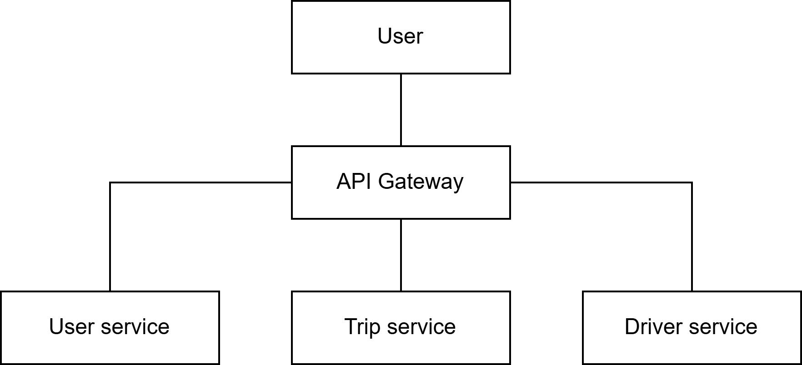
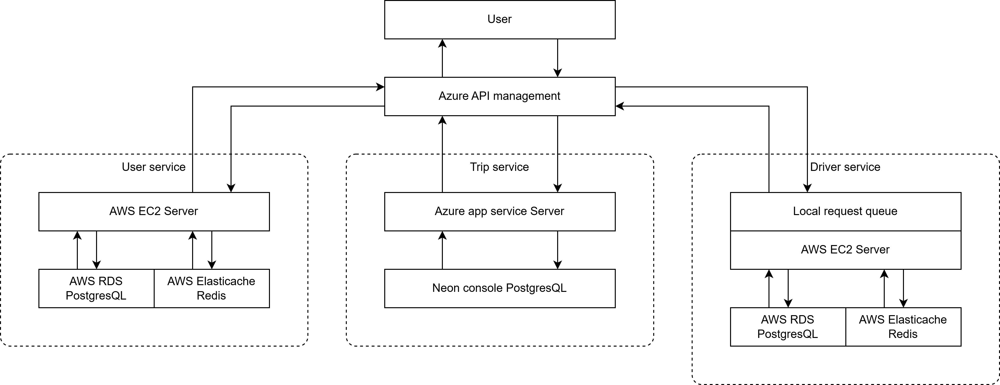

# Kiến trúc hệ thống (Architecture Overview)

Hệ thống được triển khai theo **microservice architecture** gồm 3 service chính:

- **User Service**: Quản lý thông tin khách hàng.
- **Driver Service**: Quản lý thông tin tài xế.
- **Trip Service**: Quản lý các chuyến đi và các offer, tính toán lộ trình, đánh giá chuyến đi, kết nối Driver & User.

---

## Sơ đồ kiến trúc tổng quan

## Sơ đồ kiến trúc chi tiết module A

## Giải thích sơ đồ

1. **User Service**
    - Giao tiếp với Trip Service khi người dùng đặt, hủy, xem giá cước, đánh giá chuyến đi.
    - Lưu dữ liệu chính trên PostgreSQL, cache trên Redis.

2. **Driver Service**
    - Giao tiếp với Trip Service khi tài xế chấp nhận, từ chối, hoàn thành chuyến đi.
    - Lưu dữ liệu chính trên PostgreSQL, lưu thông tin vị trí và cache trên Redis.
    - Dùng tRPC để cập nhật vị trí liên tục.

3. **Trip Service**
    - Giao tiếp với Driver Service khi tìm tài xế trong phạm vi và xem vị trí tài xế.
    - Lưu dữ liệu chính trên PostgreSQL.

---

**Ghi chú:**
- Các service có thể triển khai độc lập trên các container khác nhau (Docker).
- Mở rộng: có thể dùng **message broker (Kafka, RabbitMQ)** để đồng bộ trạng thái hoặc gửi thông báo.
